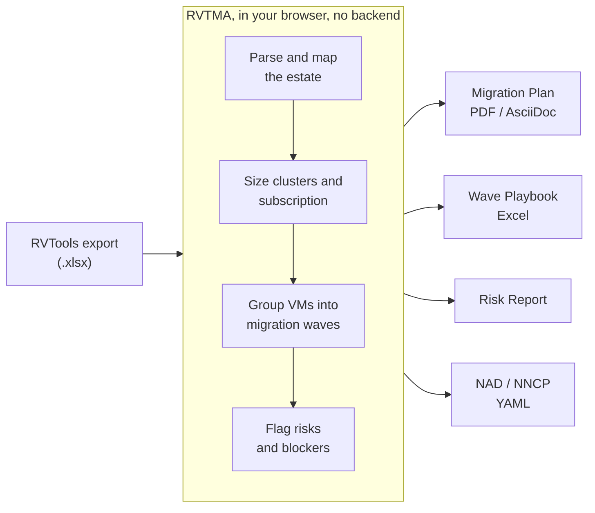

# RVTMA (RVTools Migration Analyzer) for OpenShift

[](https://quay.io/repository/elastocera/rvtma)
[](https://github.com/orgs/elastocera/packages/container/package/rvtma)
[](LICENSE)

**RVTMA (RVTools Migration Analyzer)** turns an RVTools export into a migration plan for **VMware vSphere to OpenShift Virtualization** (and any KubeVirt-based platform).

Feed it the spreadsheet your team already produces with RVTools, and it hands back the two deliverables a migration actually needs: a **planning document** for the PMs and stakeholders, and a **cutover playbook** for the technical team. Same wave numbers in both. No agents to install, no cluster to connect, nothing leaves the browser.

I wrote an entire post about the RVTMA [here](https://linuxelite.com.br/blog/rvtools-export-to-openshift-virtualization-migration-plan/).

<!-- screenshots: replace with real captures from a synthetic export -->


## Why RVTMA?

Planning a VMware to OpenShift Virtualization migration means answering the same questions every time: how many nodes, which VMs move together, what breaks, how long it takes, what it costs. The data is all in an RVTools export, but getting from a 4000-row spreadsheet to a defensible plan is hours of manual work per environment.

RVTMA does that pass in minutes: it reads the export, sizes the target clusters, groups the VMs into migration waves, flags the blockers, and produces the reports. The estimation models are calibrated against real enterprise migrations, not synthetic benchmarks.

## Features

RVTMA covers the whole path from a raw RVTools export to an execution-ready plan, and it speaks to both audiences: the stakeholders who sign off, and the technical team who runs the cutover.

**The numbers stakeholders ask for first**

- **Migration time and cost estimate.** How long the migration takes and what it costs, with a per-VM breakdown, models calibrated on real enterprise migrations (conservative by design), and 1x / 2x / 4x / 8x parallelization scenarios so you can show best case and worst case. This is the number people ask for before anything else.
- **Cluster sizing and OpenShift subscription.** How many nodes and which subscription: target topology (single-node, two-node with arbiter, compact 3-node, standalone, hosted control planes) plus an OpenShift Virtualization subscription estimate (cores, sockets, nodes, right-sized against efficient, with SKU comparison).
- **Risk and blockers.** What will break, up front: a per-VM Risk Register consolidating every blocker (USB / GPU / serial passthrough, RDMs, snapshots, old hardware, missing VMware Tools, near-full datastores, multi-NIC), a Risk Report that narrates them with verified Red Hat references, and Blast Radius failure-domain analysis.
- **Migration waves you can hand off.** Grouped by ecosystem, capped by complexity, sequenced with a deadline calculator, and packable into real maintenance windows exported as an `.ics` calendar.

**The artifacts the technical team executes with**

- **Network topology, visualized.** An interactive physical-network view: how many NICs per host, the bonding and aggregation strategy (LACP, active-backup), MTU, and how the uplinks map. The network team sees the arrangement before touching a switch port, for both 2-NIC and 4+ NIC layouts.
- **Ready-to-apply YAML.** NetworkAttachmentDefinition (NAD) in three variants (OVS bridge vmnet, OVS localnet, Linux bridge) and NodeNetworkConfigurationPolicy (NNCP) for the bond, with the **VLAN IDs pulled straight from the VMkernel data**, downloadable per workload or in bulk. StorageClass and namespace manifests too.
- **VMkernel and multi-NIC detail.** Management / vMotion / vSAN / FT role per adapter, VLAN and MTU per VMkernel interface, and every multi-NIC VM that needs a per-VM bridge review flagged by name.
- **The Wave Execution Playbook (Excel, up to 24 sheets).** A per-VM execution checklist sortable by phase and wave, the source ESXi hosts, datastores and clusters scoped to each wave, a VLANs-and-networks map with the suggested NAD type per segment, RDM analysis, and the full Risk Register, in one file to hand the cutover team.

**How it gets there**

- **Reads a full RVTools export.** Every tab it needs, tested in the field on estates of 15,000 VMs, merging several vCenter exports of the same estate in one shot, with data-quality checks that flag what is missing.
- **Maps the infrastructure.** Datacenter, department and ecosystem hierarchy, cluster and host inventory, CPU and memory utilization, HA / DRS and overcommit ratios.
- **Classifies the workloads.** SQL, Oracle, MongoDB, SAP, DMZ and Weblogic tiers alongside the OS families, a dedicated Database VMs view, and per-VM criticality and complexity scoring.
- **Checks OS compatibility.** Every guest OS mapped to its OpenShift Virtualization support tier (Certified, Commercial, Community, Known to Work), so you know what rides cleanly and what needs a conversation first.
- **Analyzes the storage.** Datastore inventory and utilization, RDM detection with VM-to-LUN mapping, projected PVC and LUN counts with array fan-out, and StorageClass guidance.

**The reports on top of all of it**

- A **Migration Plan** (PDF / AsciiDoc, in English, Portuguese and Spanish) for the PMs and stakeholders, a **Time and Cost Estimate**, the **Risk Report** with verified Red Hat references, and an **Architecture Document**. A Generate-PDF utility re-renders a report you edited by hand. Exports in PDF, AsciiDoc, Markdown, Excel and YAML.

**Private by design.** Everything runs in your browser. No backend, no telemetry, no account. The customer data in the export never leaves the tab.

## Migration waves

The migration plan, three ways against the synthetic sample: the time and cost estimate, the waves packed into maintenance windows, and the per-VM execution playbook.


## Preparing your RVTools export

RVTMA works best with a **complete** RVTools export (all tabs selected), and it gets noticeably smarter when your VMs are **organized into VMware folders**. The Migration Plan groups by the folder hierarchy, and the workload detection reads folder, resource-pool and cluster names.

The most common and best-supported layout is a three-level folder path, `Datacenter / Department / Ecosystem`:

```
/DC-A/INFRA/APP-ALPHA
/DC-A/FINANCE/SAP-ERP
/DC-B/RETAIL/WEB-FRONTEND
```

RVTMA lets you pick the folder pattern (three-level, two-level, or datacenter-only) to match your environment, so a shallower structure still works. A flat export with no folders works too, you just get coarser grouping. If your export fills the vCluster `Platform` column, workload typing is at its most precise.

## Quick Start

Run the container and bind it to port 8081:

```sh
podman run -d -p 8081:8080 --name rvtma quay.io/elastocera/rvtma:latest
```

Open the UI:

```sh
open http://localhost:8081
```

Upload your RVTools `.xlsx`, and RVTMA processes it client-side. PDF generation works out of the box in this mode: the asciidoctor + pandoc + lualatex toolchain lives inside the image.

> The image is also on GHCR at `ghcr.io/elastocera/rvtma:latest`. Quay and GHCR carry the same build; use whichever your network reaches.

## Deploying on OpenShift

Apply the manifests and grab the route:

```sh
oc new-project rvtma
oc apply -f deploy/openshift/
oc get route rvtma -n rvtma -o jsonpath='{.spec.host}'
```

## Try it with the sample export

A synthetic RVTools export lives in [`examples/`](examples/), so you can click through the whole flow without touching real data. It is generated, not scrubbed: no real hostnames, IPs, or customer names, only `acme.example.com` and friends. It carries a small multi-datacenter estate with SQL, Oracle, MongoDB, SAP and DMZ workloads organized into `Datacenter / Department / Ecosystem` folders, so the migration waves, workload detection and reports all light up.

## See RVTMA in action

<!-- swap for the embed once the walkthrough is published -->
Demo video coming soon.

## Architecture

RVTMA is a browser application. You feed it an RVTools export, it runs the whole analysis client-side, and it hands back the deliverables. Nothing is installed on the guests, no cluster is contacted, and the customer data never leaves the tab. The container image adds the PDF toolchain (asciidoctor + pandoc + lualatex) so the reports render out of the box.



## License

Apache License 2.0. See [LICENSE](LICENSE). Third-party components are listed in [THIRD_PARTY_LICENSES.md](THIRD_PARTY_LICENSES.md). Privacy details in [PRIVACY.md](PRIVACY.md).
